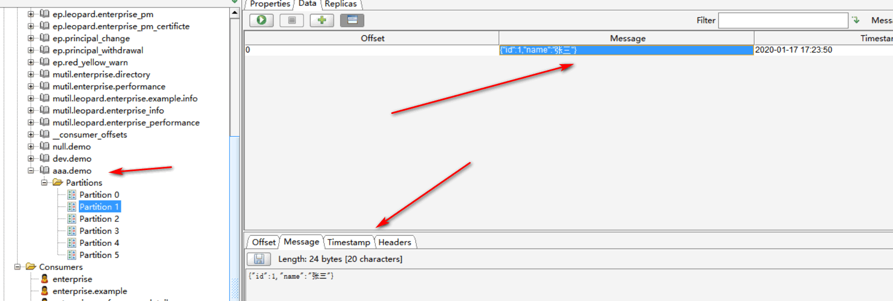

# kafka-common使用文档

```xml
    <dependency>
            <groupId>cn.shazhengbo</groupId>
            <artifactId>kafka-common</artifactId>
            <version>1.0.0</version>
        </dependency>
        <dependency>
            <groupId>org.springframework.boot</groupId>
            <artifactId>spring-boot-starter-test</artifactId>
            <scope>test</scope>
        </dependency>
        <dependency>
            <groupId>org.springframework.boot</groupId>
            <artifactId>spring-boot-starter-web</artifactId>
        </dependency>
        <dependency>
            <groupId>org.projectlombok</groupId>
            <artifactId>lombok</artifactId>
        </dependency>
```

#### 定义消息体

@EventMessage 用于定义主题信息

```java
package com;
import cn.shazhengbo.kafka.annotation.EventMessage;
import lombok.AllArgsConstructor;
import lombok.Getter;
import lombok.NoArgsConstructor;
import lombok.Setter;

import java.io.Serializable;
@Getter
@Setter
@AllArgsConstructor
@NoArgsConstructor
@EventMessage(topic = "demo")
public class Demo implements Serializable {
    private Long id;
    private String name;
}
```

### 配置文件

```yml
spring:
  kafka:
    bootstrap-servers: 192.168.0.32:9092
    #provider
    producer:
      retries: 0
      #每次批量发送消息的数量
      batch-size: 16384
      buffer-memory: 33554432
      # 指定消息key和消息体的编解码方式
      key-serializer: org.apache.kafka.common.serialization.StringSerializer
      value-serializer: org.apache.kafka.common.serialization.StringSerializer
    consumer:
      # 指定默认消费者group id
      auto-offset-reset: earliest
      enable-auto-commit: false
      # 指定消息key和消息体的编解码方式
      key-deserializer: org.apache.kafka.common.serialization.StringDeserializer
      value-deserializer: org.apache.kafka.common.serialization.StringDeserializer
#      max-poll-records: 1
sys:
 # 主题的前缀信息
 topic-prefix: aaa
```

### 发送消息

```java
package com;

import cn.shazhengbo.kafka.message.EventMessageTemplate;
import org.junit.Test;
import org.junit.runner.RunWith;
import org.springframework.beans.factory.annotation.Autowired;
import org.springframework.boot.test.context.SpringBootTest;
import org.springframework.test.context.junit4.SpringRunner;

@RunWith(SpringRunner.class)
@SpringBootTest(classes = Boot.class)
public class EventTest {
    @Autowired
    private EventMessageTemplate messageTemplate;

    @Test
    public void sendMsgTest() {
        Demo demo = new Demo(1L, "张三");
        messageTemplate.sendMessage(demo, Demo.class);
    }

}
```

